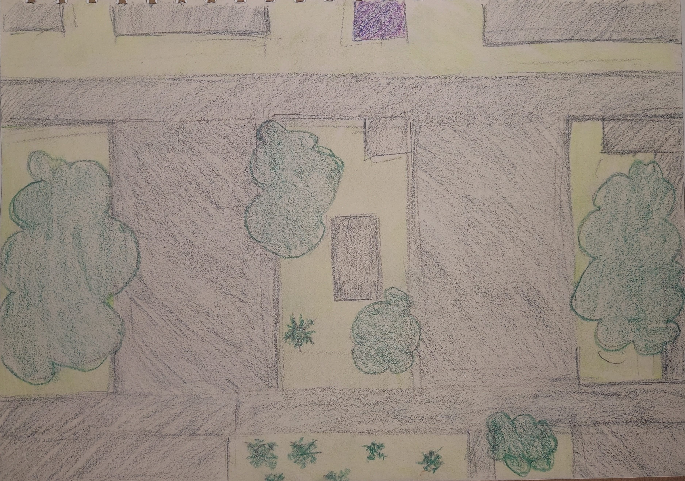
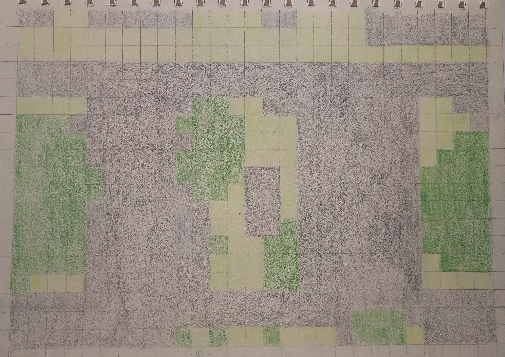
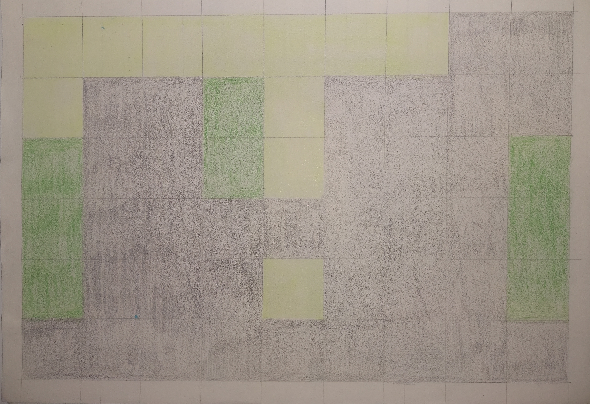

## Parte 1: Delimitação e Descrição (A Paisagem Humana)

A observação foi realizada a partir do quinto andar do Centro de Tecnológia e Geociências (CTG). Utilizei toda a extensão da folha de um caderno A4 sem pauta para fazer o desenho a mão livre do que pude observar e entender da paisagem, como copas de árvores e telhados de prédios. Não utilizei meu horizonte visível para delimitar a extensão espacial, pois a distância e sobreposição de construções impossibilitou a vizualização dos limites de de cada elemento.

Como é possível observar na imagem abaixo não utilizei o modelo PCM para fazer mapeamento estrutural da paisagem. Identifiquei a matriz, elemento mais abundante, como construções urbanas, no entanto preferi por dividir as manchas entre áreas abertas (como grama, plantas arbstivas e solo exposto) e copas de árvores.

## Parte 2: Escala, Granulação e Transmutação

## Parte 3: A “Lente Biológica” (Escala de Percepção)

## Questões para Discussão

1.Ao aumentar o tamanho do grão (Parte 2), você perdeu informações que seriam vitais para a conservação de alguma espécie específica?

2.Como a conectividade funcional mudou entre a sua visão humana e a visão do “gafanhoto”? Elementos que eram barreiras continuam sendo?

3.Você consegue identificar algum distúrbio (natural ou antrópico) que foi o responsável por criar essa heterogeneidade que você desenhou?
