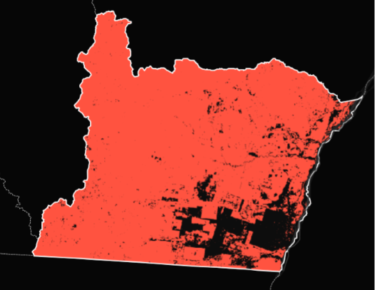
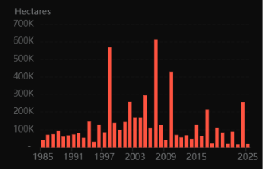
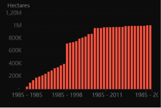
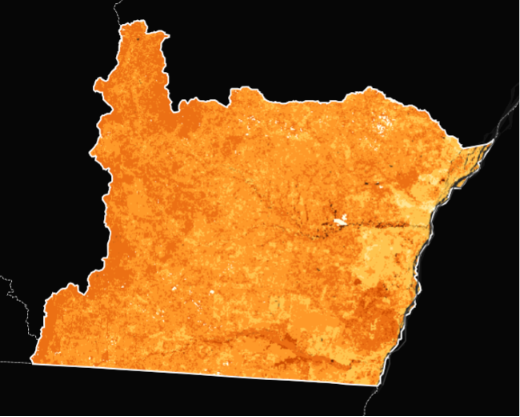

# 1. Análise descritiva da paisagem

Santana do Araguaia é um município localizado no extremo sudeste do Pará às margens do rio Araguaia, possuindo 11.591,427 km² de extensão. Para métricas do município como um todo calculei a diversidade de shannon da paisagem, proporção de cada classe e número de fragmentos por classe. É possível visualizar o resultado tabelado abaixo assim como a projeção do município, que possível 15 classes de cobertura do solo.

```{r}
#| eval: true
#| message: false
#| warning: false
#| code-fold: true
#| results: hold

library(terra)
library(tidyverse)
library(tidyterra)
library(landscapemetrics)
library(geobr)
library(ggplot2)
library(readr)
library(knitr)
library(dplyr)
library(gt)
library(tmap)

r_santana <- rast("2024_coverage_santana_araguaia.tif") #baixei 30m por conta da comparação temporal

r_utm <- project(r_santana, "EPSG:31985", method = "near")

legenda <- data.frame(
  id = c(3, 4, 6, 11, 15, 21, 24, 25, 33, 39, 41, 29, 9, 12, 30),
  Categoria = c("Formação Florestal", "Formação Savânica","Floresta Alagável",    "Campo Alagado", "Pastagem", "Mosaico de Usos", "Área Urbanizada", 
  "Outras Áreas não Vegetadas", "Corpo d'Água", "Soja", 
  "Outras lavouras temporárias", "Afloramento Rochoso", "Silvicultura",
  "Formação Campestre", "Mineração"),
  Cores = c("#006400", "#7cfc00","#007785", "#00FF7F", "#edde8e", "#ffefc3",               "#ff0000", "#d3d3d3", "#0000ff", "#f5b3c8", "#f54ca9", "#fc8114",              "#7a5900", "#ffff00", "#9c0027")
)

levels(r_utm) <- legenda[,1:2]

ggplot() +  #adicionar norte geográfico
  geom_spatraster(data = r_utm) +
  scale_fill_manual(values = legenda$Cores, na.value = "white", name = "Uso do Solo") +
  labs(title = "Santana do Araguaia (PA) em 2024 - mapbiomas") +
  theme_minimal()

# Calculando métricas para todo o município

check_landscape(r_utm)

metri_compo <- calculate_lsm(
  r_utm,
  what = c( 
    "lsm_l_shdi",   # Diversidade de Shannon
    "lsm_c_pland",  # Proporção de cada classe
    "lsm_c_np"))    # Número de fragmentos por classe

tabela_muni_total <- bind_rows(metri_compo) %>%
  left_join(legenda %>% select(id, Categoria), by = c("class" = "id")) %>%
  select(class, Categoria, metric, value) %>%
  rename(Metrica = metric,
         Valor = value)

write.csv(tabela_muni_total, "metricas_municipio_santana.csv", row.names = FALSE)

dados_muni <- read_csv("metricas_municipio_santana.csv")

kable(
  dados_muni,
  digits = 2,
  caption = "Métricas de todo o município"
  )
  
```

O valor da diversidade de shannon (1,38) demonstra uma alta heterogeneadade de paisagens dentro do município. Quanto as proporções de cada uso de terra, a maior parte do município é ocupado por pastagem (50,29%), enquanto a formação florestal ocupa 29,88% do município. Santana do araguaia também tem sua área composta por 6,63% de soja e apenas 0,10% de área urbana, sendo um município predominante rural. Quanto ao número de fragmentos por município as classes mais fragmentadas são formação florestal, pastagem, formação savânica, campo alagado, outras lavouras temporárias e floresta alagável. Quatro das fitofisionomias nativas presentes no município estão entre os usos de solo mais fragmentados.

Para entender melhor o histórico de uso de solo do município, escolhi projetar Santana do Araguaia nos anos de 1985, 2005 e 2024.Escolhi calcular o percentual de cobertura, densidade de borda e número de fragmentos para as quatro fitofisionomias presentes no município para entender quanto de cobertura dessas fitofisionomias foram perdidas ao longo dos anos e quão fragmentas elas foram nesse processo.
```{r}
#| eval: true
#| message: false
#| warning: false
#| code-fold: true
#| results: hold

# Escala temporal

# raster de 2005

r_santana_2005 <- rast("2005_coverage_santana.tif") #baixei 30m por conta da comparação temporal

r_utm_2005 <- project(r_santana_2005, "EPSG:31985", method = "near")

levels(r_utm_2005) <- legenda[,1:2]

#raster de 1985

r_santana_1985 <- rast("1985_coverage_santana.tif") #baixei 30m por conta da comparação temporal

r_utm_1985 <- project(r_santana_1985, "EPSG:31985", method = "near")

levels(r_utm_1985) <- legenda[,1:2]


ggplot() +  #adicionar norte geográfico
  geom_spatraster(data = r_utm) +
  scale_fill_manual(values = legenda$Cores, na.value = "white", name = "Uso do Solo") +
  labs(title = "Santana do Araguaia (PA) em 2024 - mapbiomas") +
  theme_minimal()

ggplot() +  #adicionar norte geográfico
  geom_spatraster(data = r_utm_2005) +
  scale_fill_manual(values = legenda$Cores, na.value = "white", name = "Uso do Solo") +
  labs(title = "Santana do Araguaia (PA) em 2005 - mapbiomas") +
  theme_minimal()

ggplot() +  #adicionar norte geográfico
  geom_spatraster(data = r_utm_1985) +
  scale_fill_manual(values = legenda$Cores, na.value = "white", name = "Uso do Solo") +
  labs(title = "Santana do Araguaia (PA) em 1985 - mapbiomas") +
  theme_minimal()


# IDs das classes de interesse
classes_interesse <- c(3, 4, 6, 11, 12)

# Função para processar um raster e calcular métricas
processar_raster <- function(raster_path, ano) {
  cat(paste0("Processando raster para o ano: ", ano, "...\n"))
  
  # Carregar o raster
  r <- rast(raster_path)
  
  # Reprojetar para UTM (EPSG:31985) se necessário
  # Nota: landscapemetrics funciona melhor com rasters projetados (metros)
  r_utm <- project(r, "EPSG:31985", method = "near")
  
  # Calcular as métricas solicitadas:
  # pland: Porcentagem de Cobertura
  # ed: Densidade de Borda
  # np: Número de Fragmentos (Patches)
  metricas <- calculate_lsm(r_utm, 
                            level = "class", 
                            metric = c("pland", "ed", "np", "ca"))
  
  # Filtrar apenas as classes de interesse e organizar
  resultado <- metricas %>%
    filter(class %in% classes_interesse) %>%
    mutate(Ano = ano) %>%
    select(Ano, Classe = class, Metrica = metric, Valor = value)
  
  return(resultado)
}

# Caminhos dos arquivos (Ajuste para os seus nomes de arquivo reais)
arquivos <- list(
  "1985" = "1985_coverage_santana.tif",
  "2005" = "2005_coverage_santana.tif",
  "2024" = "2024_coverage_santana_araguaia.tif" # ou o nome do seu raster r_utm
)

# Executar o processamento para todos os anos
lista_resultados <- lapply(names(arquivos), function(ano) {
  # Verifica se o arquivo existe antes de processar
  if (file.exists(arquivos[[ano]])) {
    return(processar_raster(arquivos[[ano]], ano))
  } else {
    warning(paste("Arquivo não encontrado para o ano", ano, ":", arquivos[[ano]]))
    return(NULL)
  }
})

# Combinar todos os anos em um único dataframe
df_final <- bind_rows(lista_resultados)

# Pivotar a tabela para que as métricas fiquem em colunas (mais fácil de ler)
tabela_escala_temp <- df_final %>%
  tidyr::pivot_wider(names_from = Metrica, values_from = Valor) %>%
  left_join(legenda %>% select(id, Categoria), by = c("Classe" = "id")) %>%
  select(Ano, Classe, Categoria, pland, ed, np, ca) %>%
  rename(Porc_Cobertura = pland, 
         Densi_Borda = ed, 
         Num_Fragmentos = np,
         Area = ca)

# Exibir o resultado final


# Salvar em CSV
write.csv(tabela_escala_temp, "metricas_santana_temporal.csv", row.names = FALSE)

dados_temp <- read_csv("metricas_santana_temporal.csv")

kable(
  dados_temp,
  digits = 2,
  caption = "Escala temporal da vegetação nativa"
)


```

Formação Florestal perdeu mais área entre 1985 e 2005, perdendo 58,90% de sua área entre 1985 e 2024. O número de fragmentos para esse uso de solo também aumentou ao longo desses três períodos. No entanto, a densidade de borda para essa classe diminuiu de 2005 para 2024, mesmo com o aumento do número de fragmentos, como essa métrica mede apenas o periméttro dos fragmentos, a diminuição dessa métrica juntamente com o aumento da quantidade de fragmentos indica diminuição do tamanho desses fragmentos.

Na Formação Savãnica houve pouca variação entre os anos de 1985 e 2005, havendo fragmentação e perda de 11,64% da sua área de 1985 a 2024. A diminuição de área de cobertura de 1985 a 2024 foi semelhante entre as outras fitofisionomias; Floresta Alagável (23,39%), Campo Alagado (26,28%) e Formação campestre (23,20%). Como é possível observar nas imagens, as vegetações nativas foram em sua maioria substituídas por pastagem e em 2024 algumas áreas de pastagens, já presentes em 2005, foram substituídas por soja.

Por conta da grande extensão do município optei por calcular as métricas ... em 15 pontos sorteados com raio de 5km, essas serão as paisagens amostrais. As de classe iram se aplicar apenas à formação florestal. Escolhi essa classe por ser a fitofisionomia nativa mais predominante, por ter sido a que mais foi desmatada e por questões biologicas explicadas no próximo tópico.

```{r}
#| eval: true
#| message: false
#| warning: false
#| code-fold: true
#| results: hold

# Criando sorteio de 15 pontos dentro de áreas de floresta de terra firme

vetor_total <- as.polygons(r_utm, dissolve = TRUE)
municipio_limite <- aggregate(vetor_total)
limite_seguro <- buffer(municipio_limite, width = -2000)

floresta <- vetor_total[vetor_total$Categoria == "Formação Florestal", ]
area_sorteio <- crop(floresta, limite_seguro)

if (is.list(area_sorteio)) {
  area_sorteio <- do.call(rbind, area_sorteio)
}

if (nrow(area_sorteio) == 0) {
  stop("Erro: Nenhuma floresta encontrada a mais de 2km da borda.")
}

matriz_reclass <- cbind(legenda$id, 1:nrow(legenda))
matriz_reclass <- rbind(matriz_reclass, c(NA, 0))
r_classificado <- classify(r_utm, matriz_reclass)
r_fator <- as.factor(r_classificado)

set.seed(1234)
pontos_finais <- NULL
tentativas <- 0

while(is.null(pontos_finais) || nrow(pontos_finais) < 15) {
  tentativas <- tentativas + 1
  cand <- spatSample(area_sorteio, size = 1, method = "random") 
  
  if (nrow(cand) > 0) {
    if (is.null(pontos_finais)) {
      pontos_finais <- cand
    } else {
      dists <- distance(cand, pontos_finais)
      if (min(dists) >= 10000) { 
        pontos_finais <- rbind(pontos_finais, cand)
      }
    }
  }
  
  if (tentativas > 5000) break
}

# Verificar CRS
if (!identical(crs(pontos_finais), crs(r_utm))) {
  pontos_finais <- project(pontos_finais, crs(r_utm))
}

buffers <- buffer(pontos_finais, width = 5000)
buffers$id_paisagem <- 1:nrow(buffers)

# Extração e processamento
extracao <- terra::extract(r_utm, buffers)
nome_col_raster <- names(extracao)[2]

tabela_final <- extracao %>%
  rename(id_buffer = ID, categoria_bruta = !!sym(nome_col_raster)) %>%
  group_by(id_buffer) %>%
  mutate(total_px = n()) %>%
  group_by(id_buffer, categoria_bruta) %>%
  summarise(
    pixels = n(),
    percentagem = (pixels / first(total_px)) * 100,
    .groups = "drop"
  ) %>%
  mutate(Categoria_Limpa = as.character(categoria_bruta)) %>%
  left_join(legenda %>% select(Categoria, Cores), by = c("Categoria_Limpa" = "Categoria"))

write.csv(tabela_final, "uso_solo_murici_final.csv", row.names = FALSE)
writeVector(pontos_finais, "pontos_final.shp", overwrite=TRUE)

# Garantir que os pontos tenham um ID para o rótulo
pontos_finais$id_ponto <- 1:nrow(pontos_finais)

ggplot() +
  geom_spatraster(data = r_utm) +
  scale_fill_manual(values = legenda$Cores, na.value = "white", name = "Uso do Solo") +
  geom_spatvector(data = buffers, fill = NA, color = "black", linewidth = 1) +
  geom_spatvector(data = pontos_finais, color = "red", size = 5, shape = 19) +
  geom_spatvector_text(data = pontos_finais, aes(label = 1:15), 
                       color = "white", size = 3, vjust = -0.8) +
  labs(title = "Paisagens amostrais buffers de 5000 m") +
  theme_minimal() +
  theme(legend.position = "bottom")

# --- Cálculo de Métricas para Todas as Classes ---

# Identificar o valor numérico da classe Floresta
id_floresta <- legenda$id[legenda$Categoria == "Formação Florestal"]

# Lista para armazenar os resultados
metricas_lista<- list()

for(i in 1:nrow(buffers)) {
  # Recortar e mascarar o raster para o buffer atual
  crop_i <- crop(r_utm, buffers[i,])
  mask_i <- mask(crop_i, buffers[i,])
  
  # Calcular as métricas desejadas
  # lsm_c_pland: % da paisagem ocupada por cada classe
  # lsm_c_np: Número de manchas por classe
  # lsm_p_enn: Distância do vizinho mais próximo (nível da mancha - patch)
  # lsm_l_shdi: Diversidade de Shannon (nível da paisagem)
  
  pland_all <- lsm_c_pland(mask_i)
  np_all    <- lsm_c_np(mask_i)
  enn_all <- lsm_p_enn(mask_i) # Retorna um valor por mancha
  shannon  <- lsm_l_shdi(mask_i)
  ai_all    <- lsm_c_ai(mask_i)
  ed_all  <- lsm_c_ed(mask_i)
  
  # Filtrar apenas a classe floresta
  pland_floresta <- pland_all %>% filter(class == id_floresta)
  np_floresta <- np_all %>% filter(class == id_floresta)
  enn_floresta <- enn_all %>% filter(class == id_floresta)
  ai_floresta <- ai_all %>% filter(class == id_floresta)
  ed_floresta <- ed_all %>% filter(class == id_floresta)
  
  
  # Extrair valores (se não houver floresta, colocar NA ou 0)
  div_shannon <- shannon$value
  perc_floresta <- ifelse(nrow(pland_floresta) > 0, pland_floresta$value, 0)
  num_frag <- ifelse(nrow(np_floresta) > 0, ed_floresta$value, NA)
  frag_prox <- ifelse(nrow(enn_floresta) > 0, ed_floresta$value, NA)  
  indice_agreg <- ifelse(nrow(ai_floresta) > 0, ed_floresta$value, NA)  
  dens_borda <- ifelse(nrow(ed_floresta) > 0, ed_floresta$value, NA)
  
    # Guardar
  metricas_lista[[i]] <- data.frame(
    paisagem = i,
    diversidade_shannon = div_shannon,
    perc_floresta = perc_floresta,
    num_fragmentos = num_frag,
    proximidade_fragmentos = frag_prox,
    indice_agregação = indice_agreg,
    densidade_borda_m_ha = dens_borda
  )
}
  
# Combinar tudo
metricas_paisagem <- bind_rows(metricas_lista)

# Salvar e visualizar
write.csv(metricas_paisagem, "metricas_paisagens_florestal_santana.csv", row.names = FALSE)

dados_buffers <- read_csv("metricas_paisagens_florestal_santana.csv")

kable(
  dados_buffers,
  digits = 2,
  caption = "Métricas da paisagem por buffer"
)

# Visualizar buffers

lista_recortes <- list()
for(i in 1:nrow(buffers)) {
  crop_i <- crop(r_utm, buffers[i, ])
  mask_i <- mask(crop_i, buffers[i, ])
  df_i <- as.data.frame(mask_i, xy = TRUE, cells = TRUE)
  df_i$id_buffer <- paste("Paisagem", i)
  lista_recortes[[i]] <- df_i
}
df_painel <- bind_rows(lista_recortes)

ggplot(df_painel) +
  geom_tile(aes(x = x, y = y, fill = Categoria)) +
  scale_fill_manual(values = setNames(legenda$Cores, legenda$Categoria)) +
  facet_wrap(~id_buffer, nrow = 3, ncol = 5, scales = "free") +
  theme_minimal() +
  labs(title = "Painel: 15 Paisagens de Santana do Araguaia-PA",
       subtitle = "Recortes circulares de 5km de raio (Interior de Floresta Terra Firme)",
       fill = "Uso do Solo") +
  theme(axis.text = element_blank(),
        axis.ticks = element_blank(),
        panel.grid = element_blank(),
        legend.position = "bottom")


```

### Referências:

MapBiomas Brasil. , [S.d.]. Disponível em: <https://brasil.mapbiomas.org/>. Acesso em: 18 jun. 2026.

Santana do Araguaia (PA) | Cidades e Estados | IBGE. Disponível em: <https://www.ibge.gov.br/cidades-e-estados/pa/santana-do-araguaia.html>. Acesso em: 17 jun. 2026. 


# 2. Diagnóstico ecológico

Para entender melhor conectividade entre fragmentos e dinamicas de metapopulações, além de avaliar o efeito de borda classifiquei os fragmentos em quatro tamanhos. Esses tamanhos se baseiam nos tamanhos testados pelo PDBFF (1 e 10 hectáres) e no tamanho de fragmento que consegue suportar aves de guilda de inssetívoras terrestres, que na amzônia são aves que ocupam grandes terristórios e são pouco resilientes a fragmentação.
Em estudos do PDBFF as aves amzonicas de áreas abertas como savanas e capinaranas, não adentraram em fragmentos florestais de 10 ha. Além disso, houve recuperação das guildas e da abundância de aves, que ocorriam antes da fragmentação, em fragmentos com 10 ha (com floresta secundária como matriz), com exceção da guilda de insetívoros terrestes. Stouffer (2007) estimou a área mínima ocupada por algumas espécies de aves da guilda de insetívoras terrestres próximas a Manaus em um fragmento de 100 ha, demonstrando que esse tamanho de fragmento é suficiente para a permanencia dessa guilda de aves que ocupam e se deslocam por um grande território, podendo haver um território de 14 hectáres para um casal.

```{r}
#| eval: true
#| message: false
#| warning: false
#| code-fold: true
#| results: hold

# Reclassificar: manter só Formação Florestal (id = 3), resto vira NA
r_floresta <- classify(r_utm, rbind(cbind(3, 3)), others = NA)

# Calcular área dos fragmentos (em hectares)
patch_area <- lsm_p_area(r_floresta)

# Converter para dataframe simples
df_area <- patch_area %>%
  as.data.frame() %>%
  rename(area_ha = value)

# Classificar nas faixas
df_area <- df_area %>%
  mutate(classe_area = case_when(
    area_ha < 1 ~ "< 1 ha",
    area_ha >= 1 & area_ha < 10 ~ "1–10 ha",
    area_ha >= 10 & area_ha < 100 ~ "10–100 ha",
    area_ha >= 100 ~ "> 100 ha"
  ))

# Contar fragmentos por classe
result_frag <- df_area %>%
  group_by(classe_area) %>%
  summarise(n_fragmentos = n()) %>%
  arrange(classe_area)

result_frag %>%
  gt() %>%
  tab_header(title = "Distribuição de Fragmentos Florestais por Tamanho")

```


### Conectividade e metapopulações 

Existem um grande número de pequenos fragmentos, mas existem também existem mais de 200 fragmentos com mais de 100 ha, podendo suportar biodiversidade biológica e servir como fonte na dinâmica de metapopulações. Pode haver conexão entre essas áreas através da Floresta Alagável e atráves de fragmentos menores que podem funcionar como trampulins. Mas é importante levar em consideração também a baixa permeabilidade que a matriz de pastagem pode apresentar para certos grupos biológicos. Por exemplo aves de áreas abertas dificilmente entram em fragmentos florestais na amazônia e conseguem se dispersar pela matriz com maior facilidade. Já aves que vivem em florestas co bioma amzônico dependem de floresta secundária, como secropias, como matriz para poderem se dispersar.


### Efeito de borda

Quanto a aves não é muito claro efeito de borda para aves que vivem em áreas florestais de Terra Firme. 


### Produtividade primária e estoque de carbono 

O mapa abaixo apresenta o fogo acumulado no município de 1985 a 2025, quase todo o município já passou por alguma queimada em algum momento (todos os mapas desse subtópico foram retirados do mapbiomas).



Abaixo o gráfico apresenta a quantidade de hectáres queimadas no município em cada ano, sendo 1997 e 2007 os anos que mais tiveram áreas queimadas.



Quanto a área queimada acumulada, foram queimados ao todo mais de 1 milhão de hectáres no município de Santana do Araguaia.



Quanto ao estoque de carbono no solo, se manteve alto e teve pouca perda de 1985 a 2025 mesmo com o desmatamento sofrido no município. O estoque de carbono presente na parte area da vegetação foi perdido, mas parte do estoque de carbono no solo ou nas raízes se manteve, podendo ser utilizado na recuper



### Referências:

Lessons from Amazonia: The Ecology and Conservation of a Fragmented Forest. Journal of Mammalogy, v. 83, n. 4, p. 1154–1156, 1 nov. 2002. 

STOUFFER, Philip C. Density, Territory Size, and Long-Term Spatial Dynamics of a Guild of Terrestrial Insectivorous Birds Near Manaus, Brazil. The Auk, v. 124, n. 1, p. 291–306, 1 jan. 2007. 

STOUFFER, Philip C. Birds in fragmented Amazonian rainforest: Lessons from 40 years at the Biological Dynamics of Forest Fragments Project. The Condor: Ornithological Applications, v. 122, n. 3, p. duaa005, 4 ago. 2020. 


# 3. Análise de Ecologia Política

Os anos escolhidos para análise temporal da paisagem no tópico 1 estão relacionadas a história desse município. 1985 é a data mais antiga disponível no mapbiomas, mas o uso do município para a criação de gado começou na década de 70. Nos anos 2000 houveram algumas despropriações de terra que resultaram em assentamentos que até hoje não estão totalmente regularizados quanto a divisão de terras.
Em 1973 a Volkwagen adquiriu 140 mil hectáres de terras públicas em Santana do Araguaia por incentivos fiscais da SUNDAM (Superintendência de Desenvolvimento da Amazônia) durante a ditadura militar. Essas terras foram utilizadas para a criação de gado e ficaram conhecidas como Fazenda Rio Cristalino.
Na década de 80 surgiram um série de denúncias contra a Volkswagen a Fazenda Rio Cristalino relacionadas a abuso, tortura e trabalho análogo a escravidão. A abertura de pastos eram realizadas em condições precárias e os trabalhadores não conseguiam sair daquela situação devido a dívidas fraudulentas e vigilãncia constante.

Mas muito antes da Fazenda Rio Cristalino naquele município já viviam populações do povo indígena Iny (como se autodenominam) ou Karajá (nome em tupi). Os Iny enfretaram epidemias e conflitos e atualmente as aldeias que permanencem em Santana do Araguaia também tiveram perda do seu território.
Por mais que historicamente os Iny vivam as margens do Rio Araguaia, existe apenas uma Terra Indígena Iny no Pará cuja o território é pequeno e inadequado. O processo de demarcação fundiária dessa Terra Indígena, Terra Indígena Karajá Santana do Araguaia (que não se localiza no município de Santana do Araguaia e sim em um município vizinho), teve graves irregularidades ao longo do tempo, resultando na demarcação de um território com terras inferteis e em área alagáveç, impossibilitando o estabelecimento de moradias fixas e até o estabelecimento de um cemitério dentro da terra indígena.

Em 1998 houve o aliciamento de moradores para a ocupação de terras, com promessas de serem sustentados por um mês e de invadir uma fazenda com escolas, hospital, ambulatório, estrada, etc. O principal lider MBST (Movimento Brasileiro dos Sem Terra) na época fez essas promessas e não voltou ao Pará por pelo menos dois meses, deixando as pessoas que invadiram as terras passando fome. Enquanto isso a desapropriação da Fazenda Rio Cristalino foi calculada em até 40 milhões de reais na epóca.
Em 2004 Governo Federal desapropriou parte da antiga Fazenda Cristalino, assentando 1300 famílias e reservando parte da área para exploração de reserva de urânio. E em 2008 o INCRA abriu processo de desapropriação de terras para fins de reforma agrária de 52 mil hectares da Fazenda Cristalino, de posse da Agropecuária Santa Bárbara Xinguara. 
No entanto, até hoje essas áreas não foram totalmente regulamentadas, se tornando um local de conflitos e disputas, havendo também assassinatos por conta desses conflitos. Há relatos de venda de propriedades dentro dos assentamentos, sem documentação ou qualquer tipo de contrato. Há um relato em especifico em que o vendedor do terreno tentou tomar de volta o terreno vendido. Havendo também um caso de tortura da população praticado por pistoleiro no Projeto de Assentamento Colônia Verde Brasileira. Além disso, o município perdeu 47,55% da população do municipio de 2011 a 2025, havendo a diminuição de 27.612 moradores.

 - Grupos beneficiados: Volkswagen e politicos/donos de terra que ganharam com desapropriamento
 - Grupos afetados negativamente: Trabalhadores da antiga fazenda rio cristalino, trabalhadores rurais sem terras ou que foram enganados no esquema de venda de terras nos assentamentos, povo indigena Iny.


### Linha do tempo

 - 1973: Volkswagen adquire 140 mil hectares de terras públicas
  - Recebeu incentivos e isenção fiscal da Superintendência de Desenvolvimento da Amazônia (SUDAM) no governo militar.
  - Conhecida como Fazenda Rio Cristalino.
  - Criação de gado
  - Denúncias de irregularidades trabalhistas, tortura e trabalho escravo
 - Década de 70: Início da demarcação da TI Santana do Araguaia em cidade vizinha 
 - 1998: Aliciamento dos moradores para ocupação de terras, pressionando INCRA para reforma agrária e indenização.
 - 2004: Governo Federal desapropria parte da antiga Fazenda Cristalino, assentando 1300 famílias e reservando parte da área para exploração de reserva de urânio.
 - 2008: INCRA abre processo de desapropriação de terras para fins de reforma agrária de 52 mil hectares da Fazenda Cristalino, de posse da Agropecuária Santa Bárbara Xinguara.
 - 2011-2025: diminuição de 27.612 moradores (47,55% da população do municipio)


### Referências:

ALANTYGEL. Famílias de trabalhadores rurais de Santana do Araguaia são vítimas de tortura praticada por pistoleiros. Comissão Pastoral da Terra - CPT, 28 set. 2012. Disponível em: <https://cptnacional.org.br/2012/09/28/familias-de-trabalhadores-rurais-de-santana-do-araguaia-sao-vitimas-de-tortura-praticada-por-pistoleiros/>. Acesso em: 16 jun. 2026

CARAJÁS, Gazeta. Santana do Araguaia é 4º município que mais perdeu moradores no Brasil - Gazeta Carajás. Disponível em: <https://www.gazetacarajas.com/noticia/santana-do-araguaia-e-4-municipio-que-mais-perdeu-moradores-no-brasil>. Acesso em: 16 jun. 2026. 

Folha de S.Paulo - Questão agrária: Desapropriação vira negócio no Pará - 15/08/99. Disponível em: <https://www1.folha.uol.com.br/fsp/brasil/fc15089914.htm>. Acesso em: 16 jun. 2026. 

LEIROS, Marcela. Quem são os Iny Karajá, etnia às margens do Rio Araguaia. Revista Cenarium, 28 abr. 2025. Disponível em: <https://revistacenarium.com.br/quem-sao-os-iny-karaja-etnia-que-preserva-tradicao-as-margens-do-rio-araguaia/>. Acesso em: 16 jun. 2026

MPF vai à Justiça pela demarcação da Terra Indígena Karajá em Santana do Araguaia: Disponível em: <https://www.olharalerta.com.br/noticia/68085/mpf-vai-a-justica-pela-demarcacao-da-terra-indigena-karaja-em-santana-do-araguaia>. Acesso em: 16 jun. 2026.

OLIVEIRA, Marcelo. PA: Volkswagen teve fazenda com trabalho escravo e verba da ditadura. Agência Pública, 31 jan. 2025. Disponível em: <https://apublica.org/2025/01/volkswagen-manteve-por-12-anos-fazenda-com-trabalho-escravo-no-pa-financiada-pela-ditadura/>. Acesso em: 16 jun. 2026

PA - Conflitos e disputas por terra na Amazônia são marcados por assassinatos na região. Mapa de Conflitos Envolvendo Injustiça Ambiental e Saúde no Brasil, [S.d.]. Disponível em: <https://mapadeconflitos.ensp.fiocruz.br/conflito/pa-conflitos-e-disputas-por-terra-na-amazonia-sao-marcados-por-assassinatos-na-regiao/>. Acesso em: 16 jun. 2026

SANTANA, Diego. Casos de Covid-19 aumentam entre povos indígenas de Santana do Araguaia. ZÉ DUDU, 17 jun. 2020. Disponível em: <https://www.zedudu.com.br/casos-de-covid-19-aumentam-entre-povos-indigenas-de-santana-do-araguaia/>. Acesso em: 16 jun. 2026

SILVA, Thawanne Rayssa Galdino. OS KARAJÁ DE SANTANA DO ARAGUAIA/PA: AGENTES E CONFLITOS EM UMA DEMARCAÇÃO DE TERRA INDÍGENA NA AMAZÔNIA DURANTE A DITADURA MILITAR (DÉCADA DE 1970). Revista Hydra: Revista Discente de História da UNIFESP, v. 8, n. 16, p. 226–248, 2024. 

SOUZA, Beatriz. Urânio, gado e reforma agrária: que fim levou a Fazenda Volkswagen? Repórter Brasil, 11 mar. 2026. Disponível em: <https://reporterbrasil.org.br/2026/03/fim-fazenda-volkswagen-trabalhadores-escravizados-para/>. Acesso em: 16 jun. 2026.


# 4. Proposta de manejo integrado

Uma das propostas é demarcar uma Terra Indígena Iny/Karajá próxima à paisagem 2; tendo seu território na paisagem 2, e ao sul e oeste dessa paisagem, se estendendo até o Rio Araguaia. Essa TI deve compreender área de Floresta de Terra Firme, e áreas de Floresta Alagável e Formação Savânica. É importante que a terra indígena possua áreas as margens do rio Araguaia, tanto para que a população indígena possa utilizar o rio e seus recursos pesqueiros, como viver próximo às margens do Rio Araguaia faz parte da história e identidade cultural dos Iny. É importante também que haja território de Terra Firme dentro da TI (Terra Indígena) para que os Iny possam plantar, caçar e construir aldeias permamentes e cemitérios.
O estabelecimento de uma TI Karajá em Santana do Aragauaia proporcionará recursos para a subexistência e maior segurança para os Iny que vivem no sudeste do Pará, auxiliando também a preservar o modo de vida e cultura desse povo. Além disso, o estabelicimento de uma TI auxilia na cobertura vegetal e conservação da biodiversidade nessa área. Para que isso seja possível será necessário o envolvimento da FUNAI e do Governo Federal, a despropriação das áreas que serão destinadas à Terra Indígena e a recuperação de áreas nesse local que hoje estão ocupadas por soja e pastagem.

Se faz necessária também a melhoria da qualidade de vida da população rural (levando também em conta a grande dimuição da população em pouco menos de uma década), envolvendo não só o acesso à saúde e à educação como também a diminuição de conflitos rurais.
Quanto ao acesso a educação, esse não se extende apenas ao ensino básico, mas também à formação e qualificação de trabalhadores rurais para práticas rentáveis e com menor impacto amiental, como extrativismo, agroflorestas ou sivicultura próxima áreas florestais, diminuindo o efeito de borda e aumentando conectividade entre os fragmentos. Além disso, maior acesso a educação possibilita com que jovens tenham outras oportunidades de trabalho além do campo, dimuindo a expansão das áreas rurais.
Quanto aos conflitos rurais, esses se ocorrem atualmente em sua maioria em assentamenos, sendo necessária a regularização da reforma agrária nos locais de conflito. Além disso, é preciso uma maior fiscalização sobre a venda de terras dentro dos assentamentos de forma ilegal ou irregular, que tem sido um dos causadores de conflitos.
Para monitoramento dessa meta, podem ser utilizados indices de conflitos rurais, nível de escolaridade médio, idh do município e uso do solo nos assentamentos.

A seguir foram geradas imagens com os imóveis rurais declarados no Sigef e SNCI com a retirada dos imóveis dentro dos assentamentos, pois diante das reportagens e relatos sobre conflitos de terras dentro dos assentamento, preferi considerar que a maior parte dos os assentamos ou todos eles não estão totalmente regularizados quanto a divisão e titulação de terras. Também gerei um mapa com todos os assentamentos e imóveis rurais declarados nesses assentamentos. Além disso, calculei cobertura florestal no imóveis com mais de 4 módulos rurais (300 ha em santana do Araguaia) para saber se eles estão regularizados ambientalmente quanto à Reserva Legal.

```{r}
#| eval: false
#| message: false
#| warning: false
#| code-fold: true
#| include: false
#| results: false

## Criando limite para município
vetor_total <- as.polygons(r_utm, dissolve = TRUE)
municipio_limite <- aggregate(vetor_total)


## Raster fundiário SNCI

# Carregar o shapefile de municípios do Pará
municipios_pa <- vect("C:/Users/Anna/Documents/disciplinas_bach/ecologia_de_paisagens/diario_ecologia_anna/exercicios/shapefiles/PA_Municipios_2025/PA_Municipios_2025.shp")
print(municipios_pa) #saber nome da coluna e se o município está em letra maíscula ou minúscula

# Filtrar apenas Santana do Araguaia
santana_poligono <- municipios_pa[municipios_pa$NM_MUN == "Santana do Araguaia", ]
nrow(santana_poligono)

# Carregar o shapefile fundiário SNCI
shp_snci <- vect("C:/Users/Anna/Documents/disciplinas_bach/ecologia_de_paisagens/diario_ecologia_anna/exercicios/shapefiles/SNCI_Brasil_PA/SNCI_Brasil_PA.shp")

# ALINHAR OS CRS
# Para cruzar dois shapes, eles precisam estar na mesma projeção.
# Colocar o SNCI na mesma projeção do polígono de Santana.
shp_snci <- project(shp_snci, crs(santana_poligono))

# CORTAR O SHAPEFILE SNCI PELO LIMITE DE SANTANA
snci_santana <- terra::intersect(shp_snci, santana_poligono)

## Raster fundiário Sigef

# Carregar o shapefile fundiário Sigef
shp_sigef <- vect("C:/Users/Anna/Documents/disciplinas_bach/ecologia_de_paisagens/diario_ecologia_anna/exercicios/shapefiles/Sigef_Brasil_PA/Sigef_Brasil_PA.shp")

# ALINHAR OS CRS
# Para cruzar dois shapes, eles precisam estar na mesma projeção.
# Colocar o SNCI na mesma projeção do polígono de Santana.
shp_sigef <- project(shp_sigef, crs(santana_poligono))

# CORTAR O SHAPEFILE SNCI PELO LIMITE DE SANTANA
sigef_santana <- terra::intersect(shp_sigef, santana_poligono)

# Unir SNCI e SIGEF 

# Usamos 'rbind' para juntar as tabelas. 
# Nota: Se houver sobreposição espacial, o 'union' seria mais rigoroso, 
# mas o 'rbind' é mais rápido para análise de cobertura.
terras_fund <- rbind(snci_santana, sigef_santana)

# Reprojetar o novo shapefile para o raster de cobertura
fund_santana_utm <- terra::project(terras_fund, crs(r_utm))

print(fund_santana_utm) #conferir se está tudo certo
nrow(fund_santana_utm) #conferir se está tudo certo

# Cortar e mascarar o raster usando esse limite
r_masked_fund <- crop(r_utm, fund_santana_utm)
r_masked_fund <- mask(r_masked_fund, fund_santana_utm)

# Visualizar
ggplot() +
  geom_spatraster(data = r_masked_fund) +
  geom_spatvector(data = fund_santana_utm, fill = NA, color = "black", linewidth = 0.5) + # Opcional: desenha os limites do SNCI por cima
  geom_spatvector(data = municipio_limite, fill = NA, color = "black", linewidth = 0.5) +
  scale_fill_manual(values = legenda$Cores, na.value = "white", name = "Uso do Solo") +
  labs(title = "Terras declaradas no SNCI e Sigef em Santana do araguaia - 2025 ") +
  theme_minimal()


## Raster fundiário Assentamentos

# Carregar o shapefile fundiário Sigef

shp_assen <- vect("C:/Users/Anna/Documents/disciplinas_bach/ecologia_de_paisagens/diario_ecologia_anna/exercicios/shapefiles/Assentamento_Brasil/Assentamento_Brasil.shp")

print(shp_assen)
nrow(shp_assen)

# ALINHAR OS CRS
# Para cruzar dois shapes, eles precisam estar na mesma projeção.
# Colocar o SNCI na mesma projeção do polígono de Santana.
shp_assen <- project(shp_assen, crs(santana_poligono))

# CORTAR O SHAPEFILE SNCI PELO LIMITE DE SANTANA
assen_santana <- terra::intersect(shp_assen, santana_poligono)

print(assen_santana)
nrow(assen_santana)

# Reprojetar o novo shapefile para o raster de cobertura
assen_santana_utm <- terra::project(assen_santana, crs(r_utm))

print(assen_santana_utm) #conferir se está tudo certo
nrow(assen_santana_utm) #conferir se está tudo certo

# Cortar e mascarar o raster usando esse limite
r_masked_assen <- crop(r_utm, assen_santana_utm)
r_masked_assen <- mask(r_masked_assen, assen_santana_utm)

# Visualizar
ggplot() +
  geom_spatraster(data = r_masked_assen) +
  geom_spatvector(data = assen_santana_utm, fill = NA, color = "black", linewidth = 0.5) + # Opcional: desenha os limites do SNCI por cima
  geom_spatvector(data = municipio_limite, fill = NA, color = "black", linewidth = 0.5) +
  scale_fill_manual(values = legenda$Cores, na.value = "white", name = "Uso do Solo") +
  labs(title = "Assentamentos em Santana do araguaia - 2025 ") +
  theme_minimal()


```

```{r}
#| eval: true
#| message: false
#| warning: false
#| code-fold: true
#| results: hold

# --- Preparação dos Shapefiles Fundiários e de Assentamentos ---

## Criando limite para município
vetor_total <- as.polygons(r_utm, dissolve = TRUE)
municipio_limite <- aggregate(vetor_total)

# Carregar o shapefile de municípios do Pará (ajuste o caminho conforme necessário)
municipios_pa <- vect("C:/Users/Anna/Documents/disciplinas_bach/ecologia_de_paisagens/diario_ecologia_anna/exercicios/shapefiles/PA_Municipios_2025/PA_Municipios_2025.shp")

# Filtrar apenas Santana do Araguaia
santana_poligono <- municipios_pa[municipios_pa$NM_MUN == "Santana do Araguaia", ]

# Carregar SNCI e SIGEF
shp_snci <- vect("C:/Users/Anna/Documents/disciplinas_bach/ecologia_de_paisagens/diario_ecologia_anna/exercicios/shapefiles/SNCI_Brasil_PA/SNCI_Brasil_PA.shp")
shp_sigef <- vect("C:/Users/Anna/Documents/disciplinas_bach/ecologia_de_paisagens/diario_ecologia_anna/exercicios/shapefiles/Sigef_Brasil_PA/Sigef_Brasil_PA.shp")

# Carregar o shapefile de Assentamentos
shp_assen <- vect("C:/Users/Anna/Documents/disciplinas_bach/ecologia_de_paisagens/diario_ecologia_anna/exercicios/shapefiles/Assentamento_Brasil/Assentamento_Brasil.shp")

# Reprojetar todos para o CRS do polígono de Santana
shp_snci <- project(shp_snci, crs(santana_poligono))
shp_sigef <- project(shp_sigef, crs(santana_poligono))
shp_assen <- project(shp_assen, crs(santana_poligono))

# Cortar todos pelo limite de Santana do Araguaia
snci_santana <- terra::intersect(shp_snci, santana_poligono)
sigef_santana <- terra::intersect(shp_sigef, santana_poligono)
assen_santana <- terra::intersect(shp_assen, santana_poligono)

# Reprojetar o shapefile de assentamentos para o raster de cobertura (para uso posterior)
assen_santana_utm <- terra::project(assen_santana, crs(r_utm))

# --- União de SIGEF e SNCI e Resolução de Sobreposição com Assentamentos ---

# 3.1. Unir SIGEF e SNCI
# Usamos 'union' para combinar as geometrias e atributos. Isso cria novas feições onde há sobreposição.
# Para simplificar a análise subsequente, podemos dissolver as geometrias unidas.
terras_fund_uniao <- terra::union(snci_santana, sigef_santana)

# Se houver atributos duplicados ou que não são relevantes para a união, podemos simplificar antes de dissolver
# Ou selecionar apenas os atributos que queremos manter.
# Por exemplo, se quisermos apenas a geometria, podemos fazer:
# terras_fund_uniao_geom <- terra::aggregate(terras_fund_uniao, dissolve = TRUE)
# Para manter os atributos e lidar com sobreposições, 'union' é o correto.

# 3.2. Remover áreas de assentamento da união SIGEF/SNCI
# As áreas de assentamento serão 'apagadas' da união SIGEF/SNCI.
fund_santana_sem_assentamento <- terra::erase(terras_fund_uniao, assen_santana)

# 3.3. Criar SpatVector com a sobreposição dos três (SIGEF+SNCI dentro de Assentamentos)
# Isso representa as áreas de SIGEF/SNCI que *estão* dentro dos assentamentos.
fund_santana_apenas_assentamento <- terra::intersect(terras_fund_uniao, assen_santana)

#unir imoveis dentro de assentamentos com os limites dos assentamentos
terras_assen <- rbind(fund_santana_apenas_assentamento, assen_santana)

# Reprojetar o shapefile resultante (sem e apenas assentamentos) para o raster de cobertura
fund_santana_utm <- terra::project(fund_santana_sem_assentamento, crs(r_utm))
assen_santana_utm <- terra::project(terras_assen, crs(r_utm))

# Cortar e mascarar o raster usando o limite fundiário sem assentamentos
r_masked_fund <- crop(r_utm, fund_santana_utm)
r_masked_fund <- mask(r_masked_fund, fund_santana_utm)

# Cortar e mascarar o raster usando o limite fundiário apenas assentamentos
r_masked_assen <- crop(r_utm, assen_santana_utm)
r_masked_assen <- mask(r_masked_assen, assen_santana_utm)

# --- 4. Cálculo de Áreas e Agrupamento ---

# No terra, expanse() calcula em m². Dividimos por 10.000 para hectares.
fund_santana_utm$area_ha <- expanse(fund_santana_utm, unit = "ha")

# Criar os dois grupos
pequenas <- fund_santana_utm[fund_santana_utm$area_ha <= 300, ]
grandes  <- fund_santana_utm[fund_santana_utm$area_ha > 300, ]

# --- 5. Calcular Proporção das Classes (PLAND) ---
# IDs solicitados: 3, 4, 6, 11 e 12 (Formação Campestre é ID 12 no MapBiomas)
#ids_interesse <- c(3, 4, 6, 11, 12)

# Função para calcular PLAND (Percentage of Landscape) para um grupo ou feição individual
calcular_pland <- function(raster, mascara, titulo) {
  # Corta o raster pela máscara do grupo
  r_crop <- crop(raster, mascara)
  r_mask <- mask(r_crop, mascara)
  
  # Calcula a métrica PLAND (porcentagem da classe)
  metricas <- calculate_lsm(r_mask, what = c("lsm_c_pland", "lsm_l_ta"))
  
  # Filtra apenas as classes de interesse e organiza
  resultado <- metricas %>%
    left_join(legenda, by = c("class" = "id")) %>%
    mutate(Grupo = titulo) %>%
    select(Grupo, Categoria, value)
  
  return(resultado)
}

# Executar para os dois grupos como um todo
res_pequenas_total <- calcular_pland(r_utm, pequenas, "Até 300 ha (Total)")
res_grandes_total  <- calcular_pland(r_utm, grandes, "Mais de 300 ha (Total)")

# --- 6. Calcular Métricas Individualmente para Áreas > 300 ha ---

# Salavar resultados
write.csv(res_pequenas_total, "metricas_total_ate_300.csv", row.names = FALSE)
write.csv(res_grandes_total, "metricas_total_maisde_300.csv", row.names = FALSE)

# Inicializar a lista para armazenar os resultados individuais
metricas_grandes_individuais <- list()

# Iterar sobre cada feição no grupo \'grandes\'
if (nrow(grandes) > 0) { # Adicionada verificação para garantir que há propriedades no grupo
  for (i in 1:nrow(grandes)) {
    propriedade_atual <- grandes[i, ]
    
    # Criar um identificador para a propriedade
    id_propriedade <- paste0("Propriedade_", i, "_Area_", round(propriedade_atual$area_ha, 2), "ha")
    
    # Calcular PLAND para a propriedade individual
    metricas_individuais <- calcular_pland(r_utm, propriedade_atual, id_propriedade)
    
    # Adicionar ao resultado, se não for NULL
    if (!is.null(metricas_individuais)) {
      metricas_grandes_individuais[[id_propriedade]] <- metricas_individuais
    }
  }
}

# Combinar todos os resultados individuais em um único data frame
metricas_grandes_individuais_df <- do.call(rbind, metricas_grandes_individuais)

#salvar resultados
write.csv(metricas_grandes_individuais_df, "metricas_individual_maisde_300.csv", row.names = FALSE)

# --- 7. Visualização (Opcional) ---

# Visualizar o resultado da união SIGEF/SNCI sem assentamentos
 ggplot() +
   geom_spatraster(data = r_masked_fund) +
   geom_spatvector(data = fund_santana_utm, fill = NA, color = "black", linewidth = 0.5) +
   scale_fill_manual(values = legenda$Cores, na.value = "white", name = "Uso do Solo") +
    geom_spatvector(data = municipio_limite, fill = NA, color = "black", linewidth = 0.5) +
   labs(title = "Imóveis rurais (SIGEF/SNCI) fora dos Assentamentos em Santana do Araguaia - 2025") +
   theme_minimal()

# Visualizar a sobreposição de SIGEF/SNCI com Assentamentos
 ggplot() +
   geom_spatraster(data = r_masked_assen) +
   geom_spatvector(data = assen_santana_utm, fill = NA, color = "black", linewidth = 0.5) +
   scale_fill_manual(values = legenda$Cores, na.value = "white", name = "Uso do Solo") +
   geom_spatvector(data = municipio_limite, fill = NA, color = "black", linewidth = 0.5) +
   labs(title = "Sobreposição de Terras Fundiárias (SIGEF/SNCI) com Assentamentos em Santana do Araguaia - 2025") +
   theme_minimal()

0.8-0.3368  # 80% de cobertura menos a cobertura florestal atual em imoveis rurais com mais de 4 módulos fiscais (75 ha é o módulo rural desse munícipio), ou seja, com mais de 300 ha
 
869397.9136*0.4632 # área total de todos os imóveis rurais vezes porcentagem de de área florestal que precisa ser reflorestada
 
402705.1/1159142.7 # área total que precisa ser reflorestada dividida pela área do município, resultando em quanto porcento do município precisa ser reflorestado

```
Pelos resultados para que todos os imóveis rurais estejam regularizados ambientalmente (considerando apenas Reserva Legal) seria necessário o reflorestamento de cerca de 402705 hectáres equivalente a 34,74% da área do município. Esse valor é uma extrapolações, pois algumas propriedades à leste possuem naturalmente mais área de Formação Savânica que Formação Savânica, não fazendo sentido que 80% desses imóveis sejam convertidos para Formação Florestal.
Dessa forma, uma das metas para o município é a adequação ambiental para imóveis rurais com mais de 300 ha, sendo utilizado o CAR (Cadastro Ambiental Rural) como forma de monitoramento, assim como as proporções de cobertura florestal. Para garantir que os proprietários se regularizem pode ser dificultado o acesso à crédito rural aqueles que não se regularizaram ou não estão no processo de regularização. Se possível seria interessante projetar o reflorestamento dessas reservas legais em conjunto com os proprietários de forma a aumentar a conectividade entre fragmentos maiores.

## Referências:

https://www.legisweb.com.br/legislacao/?id=416495
