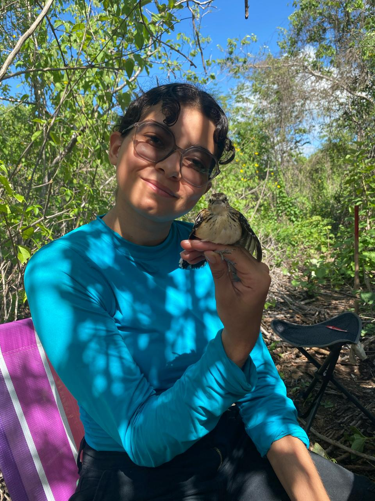

## Sobre este diário

Este site é meu portfólio pessoal da disciplina **Ecologia de Paisagens** (BO-304) da Universidade Federal de Pernambuco, ministrada pelo Prof. Felipe Melo.

Aqui você encontrará:

-   📓 Anotações das aulas
-   📊 Relatórios das análises em R
-   🌿 Reflexões sobre Ecologia de Paisagens

## Sobre mim

Sou estudante de graduação em Ciências Biológicas (bacharelado) do Centro de Biociências — UFPE. Estagiei no Laboratório de Ecologia e Evolução de Aves, Universidade Federal de Pernambuco sob orientação de Luciano Nicolas Naka e atualmente faço parte da equipe de amostragem de eves do PPBio RABECA. Minha pesquisa investiga variações fenótipicas e genéticas entre populações da ave *Radinopsyche sellowi*, sobre tudo entre as populações da Caatinga, Cerrado e Amazônia, procurando entender a história biogeográfica desse táxon.

{width="300"}
